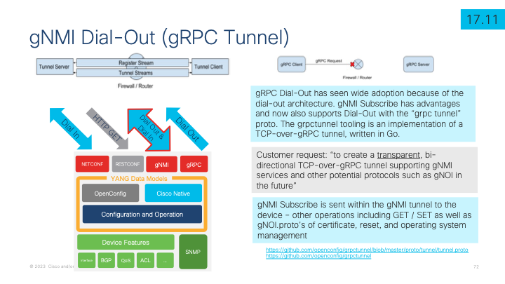

# Cisco IOS XE and Catalyst 9000 - Programmability & Automation with gNMI

This lab details some of the capabilities of the gNMI API on Cisco IOS XE that is described in great detail in the [Programmability Configuraiton Guide - gNMI chapter](https://www.cisco.com/c/en/us/td/docs/ios-xml/ios/prog/configuration/1712/b_1712_programmability_cg.html) 


# IOS XE Device Programmability & Automation Overview

There are many capabiities within the IOS XE device programmability & automation lifecycle. The focus of this lab is the gNMI features within Day 1 for Device Configuration and configuration management, Day 2 for Model Driven Telemetry, and Day N for the gNOI device operational workflows for TLS certificate management services, factory reset services, and operating system image upgrade services.


# gNMI Overview

The gNMI API supports a variety of common operations. The "capabilities" exchange is similar to NETCONF where the supported YANG data modules are returned from the API when polled. The capabilities exchanges shows all of the supported YANG data modules which will be used as part of additional workflows, operations, and use cases. 

The GET and SET operation allow retreival and management of operational and device configuraiton. These are the typical device configuation management usecases including interface statistic and state retreival and configuration of decription, assigned VLAN, and other common interface configuration settings.


# Enable gNMI API on IOS XE

There are two gNMI services on IOS XE which is the "gnmi server" that does not use or validate TLS and runs on port 50052 per Cisco by default. The other is the "gnmi secure-server" which more closely follows the gNMI specification for TLS and runs on port 9339 per IANA by default. Both gNMI services can be enabled at the same time, however for production it is recommended to follow best-practices regarding the use of TLS. 

This example shows the most basic way to enable gNMI without secure TLS on the default port 50052

**gNMI Server without TLS - Lab**
```
gnxi
gnxi server
! gnxi port 50052
```

Next is the gNMI secure example where a self-signed certificate if used.

**gNMI Service with TLS - Lab**

```
gnxi
service internal
gnxi secure-allow-self-signed-trustpoint
! gnxi secure-port 9339
gnxi secure-server
```

Finally the recommended way to enable gNMI is to install a certificate into the Cisco IOS XE crypto trustpoint and then bind the gNMI service to this certificate with the **gnxi secure-trustpoint** CLI

**gNMI Service with TLS – Production**
```
gnxi
gnxi secure-trustpoint <trustpoint name>
gnxi secure-server
```

There is one more option which is to use the gNMI bootstrapping feature implemented within IOS XE. When the gnxi secure-init CLI is used then self-signed certificates are generated but the API only accepts bootstrapping of the certificate via the cert.proto mechanism. Cert.proto will be discussed later on in greater detail.

**gNMI Service with TLS – Production with cert.proto**
```
gnxi
gnxi secure-init 
```

The follow image describes enabling gNMI and also shows the show CLI of **show gnxi state detail** to understand the state of the API once enabled.


# Cisco YANG Suite

The following sections use the [Cisco YANG Suite tooling from developer.cisco.com](https://developer.cisco.com/yangsuite/) 
 which has additional details also available at
[Github.com/CiscoDevNet/yangsuite](
 https://github.com/CiscoDevNet/yangsuite/)

In this lab the YANG Suite tooling is already setup, the device has been added, and the YANG data modules have been addded to the repository/set and are available for use within the tool. Details for these steps can be found in the YANG Suite site with supporting documentation.


# gNMI Capabilities

The capabilties exchange is accessed from the gNMI plugin of YANG Suite once the device has been selected then the **Capabilities** button will send the RPC that returns the list of data modules, the version or date, and a brief description.


# gNMI GET

The gNMI GET in this example is against the **Cisco-IOS-XE-interfaces-oper.YANG** module where the top level **interfaces** container has been selected. All data from the **interface** list will be collected for each of the keyed values. The keyed values for this module is the **"name"** which is the Interface Name, typically Gigabit0/0, GigabitEthernet6/0/4, etc.

The GET payload in this example has several options specified for the **Cisco Native** data model: The origin is **RFC 7951** and the Encoding Type is **JSON_IETF**. **PROTO** encoding is also supported.


The gNMI RPC used in this example is:

```
{
  "path": [
    {
      "origin": "rfc7951",
      "elem": [
        {
          "name": "Cisco-IOS-XE-interfaces-oper:interfaces"
        }
      ]
    }
  ],
  "encoding": "JSON_IETF"
}

```

Once the **Run RPC** button is selected then the payload is sent to the gNMI API which processes and it repsonds back with the data in the **json_ietf_val** field


The **json_ietf_val** is further decoded by YANG Suite so it's easier to understand the JSON blobs that are received:


Here is just the statistics and some additional leafs from the **TenGigE1/0/10** interface

```      
"name": "TenGigabitEthernet1/0/10",
      "interface-type": "iana-iftype-ethernet-csmacd",
      "admin-status": "if-state-up",
      "oper-status": "if-oper-state-ready",
      "last-change": "2023-09-19T19:31:10.809+00:00",
      "if-index": 18,
      "phys-address": "f4:ee:31:54:a2:0a",
      "speed": "1000000000",
      "statistics": {
        "discontinuity-time": "2023-09-19T19:28:07+00:00",
        "in-octets": "1414387926",
        "in-unicast-pkts": "4536232",
        "in-broadcast-pkts": "81061",
        "in-multicast-pkts": "81044",
        "in-discards": 0,
        "in-errors": 0,
        "in-unknown-protos": 0,
        "out-octets": 2303595023,
        "out-unicast-pkts": "13028767",
        "out-broadcast-pkts": "5368080",
        "out-multicast-pkts": "4229537",
        "out-discards": "0",
        "out-errors": "0",
        "rx-pps": "1",
        "rx-kbps": "1",
        "tx-pps": "5",
        "tx-kbps": "5",
        "num-flaps": "0",
        "in-crc-errors": "0",
        "in-discards-64": "0",
        "in-errors-64": "0",
        "in-unknown-protos-64": "0",
        "out-octets-64": "2303595023"
```

This is an example of a GET for opererational data like the interface statitics and counters.

The next example is a GET of the configuration the will be modified in the next example.

In this example the **Cisco-IOS-XE-native.YANG** module is used which represents the majority of the **running-config** from Cisco IOS XE. The **hostname** leaf will be used in this example.

The following RPC is generated and sent to retreive the device hostname:

```
{
  "path": [
    {
      "origin": "rfc7951",
      "elem": [
        {
          "name": "Cisco-IOS-XE-native:native"
        },
        {
          "name": "hostname"
        }
      ]
    }
  ],
  "encoding": "JSON_IETF"
}
```
Once this payload is send and received by YANG Suite, the results show the hostname: **jcohoe-c9300x** - In the next step the SET operation will be used to change this configuration


# gNMI SET

The gNMI **SET** operation is used to SetUpdate, SetReplace, or SetDelete the configuraiton. Since no additional SET operation is defined the default per specification **Update** is used.


The payload sent in this example to update the hostname is:

```
{
  "update": [
    {
      "path": {
        "origin": "rfc7951",
        "elem": [
          {
            "name": "Cisco-IOS-XE-native:native"
          },
          {
            "name": "hostname"
          }
        ]
      },
      "val": {
        "jsonIetfVal": "\"set-by-gnmi\""
      }
    }
  ]
}
```

The response from the API is below showing that the API call was successfull


Performing another GET operation will confirm the newly updated hostname configuration


This example shows how to use the **Cisco Native** data model to upate the running configuration of the device. While the use case is for **hostname** any other feature or configuration can easily be managed in this way

# gNMI Subscribe for Model Driven Telemetry

The gNMI API also supports the **subscribe** operation for Model Driven Telemetry with the same set of YANG modules as seen in the capabilities exchange. 

For a deeper dive into Model Driven Telemetry refer to the [Github.com/jeremycohoe/cisco-ios-xe-mdt](https://github.com/jeremycohoe/cisco-ios-xe-mdt) github repository

In this example the **Cisco-IOS-XE-poe-oper** YANG data model will be used. This YANG module includes per-port Power-over-Ethernet statistics including how much power energy in watts is available and consumed.

The **Subscribe** payload is below which shows the settings needed to successfully create the Model Driven Telemetry subscription over gNMI. In this example the **Stream** mode is selected with a **Sample** interval set to 30 seconds and the **RFC7951** encoding is used since this is a Cisco Native module. Path Prefixing is not enabled


The **Subscribe** payload that is generated looks similar to below

```
{
  "subscribe": {
    "subscription": [
      {
        "path": {
          "origin": "rfc7951",
          "elem": [
            {
              "name": "Cisco-IOS-XE-poe-oper:poe-oper-data"
            },
            {
              "name": "poe-port-detail"
            }
          ]
        },
        "mode": "SAMPLE",
        "sampleInterval": "30000000000"
      }
    ],
    "encoding": "JSON_IETF"
  }
}
```

Once this payload is sent from YANG Suite to the gNMI API the response is seen. It shows that port TenGig1/0/37 is showing a value of **41.89 watts of power-used**


After the sample interval of 30 seconds occurs then another payload is received from the gNMI API to YANG Suite which contains updated statistics and counters


Subscribing to Model Driven Telemetry in YANG Suite is a good start to validating that the data expected is received from the API. This is useful when building additional charts and graphs in other tooling systems. The recommended tooling is **Telegraf from InfluxDB** or the [Cisco Telemetry Broker](https://cs.co/telemetrybroker) available from Cisco Security

# gNOI Overview
gNOI, or the gRPC Network Operations Interface, is defined by proto files and enables operational workflows. The supported gNOI "protos" are cert.proto, reset.proto, and os.proto. These gNOI workflow API's handle TLS certificate installation and management including for gNOI bootstrapping, performing factory resets including zero-fill of all device disks, and for upgrading or downgrading the version of the running operating system.

Additional details about the gNOI are available in the [Programmability Configuration Guide - gNOI chapter](https://www.cisco.com/c/en/us/td/docs/ios-xml/ios/prog/configuration/1712/b_1712_programmability_cg/m_1712_prog_gnoi_protocol.html)


# gNOI certificate management service (cert.proto)

The gNOI cert.proto "certificate management service" is available to manage TLS certificate in the Cisco IOS XE truststore. Described at https://github.com/openconfig/gnoi/blob/master/cert/cert.proto
“This file defines the gNOI API to be used for certificate installation and rotation”


Cert.proto has several supported RPC operations to manage the lifecycle of the TLS certificate. 

Install, Rotate, Revoke, GetCertificate, and CanGenerateCSR are the RPC operations that are supported and their functions are described in detail in the proto definition and summarized below


## gNOI Bootstrapping

As mentioned earlier the gNOI bootstrapping feature is used to install certificates into the gNMI API service. Wait what. Yes... it's an API call that is sent to the gNMI API that leverages gNOI to install the certificate that is automatically installed and immediatley used by the gNMI API for all further secure communications. As part of the process the gNMI API service does go through a restart and will go from OPER UP to DISABLE DOWN then back to OPER UP with the new certifiate that was received as part of the gNOI cert.proto payload.

gNOI bootstrapping [is described in more detail in the guide](https://www.cisco.com/c/en/us/td/docs/ios-xml/ios/prog/configuration/1712/b_1712_programmability_cg/m_1712_prog_gnoi_protocol.html#Cisco_Concept.dita_87c3eaca-1d91-4b9b-b2c7-22972b74aaad)


## gNOI Install Example

A detaied lab guide specifically for cert.proto is available from [Github.com/jeremycohoe/cisco-catalyst-gnoi-cert.proto](https://github.com/jeremycohoe/cisco-catalyst-gnoi-cert.proto) and below a sample from that guide with the most relevant section.

The gnoi_cert tooling is available from https://github.com/google/gnxi/tree/master/gnoi_cert The commands to install the gnoi_cert tooling are:

```
go get github.com/google/gnxi/gnoi_cert
go install github.com/google/gnxi/gnoi_cert
```

Loading the certificates can be done using the gnoi_cert tooling as shown below. 

The name of the crypto trustpoint is specified in the "cert-id" field which is set to **gnxi-cert**

The following command is used to provision the certificates:

**gnoi_cert -target_addr jcohoe-c9300.cisco.com:9339 -op provision -target_name jcohoe-c9300 -alsologtostderr -organization "jcohoe org" -ip_address 10.85.134.65 -time_out=10s -min_key_size=2048 -cert_id gnxi-cert -state BC -country CA -ca ./rootCA.pem -key ./rootCA.key**

You will see a log message like "Install Successfull"

Refer to the [demo video](https://youtu.be/iZoF_KtN_Es) for a short and silent demo.


# gNOI factory reset (reset.proto)

The Factory reset is called with a single API call and used as part of RMA, re-provisioning, security, and ZTP automation workflows. The gNOI reset.proto API is described at [Github OpenConfig gNOI factory_reset](https://github.com/openconfig/gnoi/blob/master/factory_reset/)
with tooling from [Github Google GNXI gnoi_reset](https://github.com/google/gnxi/tree/master/gnoi_reset) 

gNOI defines a set of gRPC-based microservices for executing operational commands on network devices. Reset has support for the start RPC operation which programmatically uses the “factory-reset all” or “factory-reset switch all all” for stacks

The feature is supported when the device is installed using install mode and not when using the legacy bundle mode. During the factory reset operation the current operating system image files are used to boot the device with after the operation completes

Secure wipe of the disks with zero’s is an optional and supported security feature when the “zero_fill” option and configuration flag is used


## Reset.proto example

Below is the CLI used with the **gnoi_reset** binary to trigger the factory reset

```
auto@pod24-xelab:~$ ./gnoi_reset -target_addr 10.1.1.5:50052 -target_name c9300 -notls -zero_fill
I1014 11:53:15.248633 2761247 gnoi_reset.go:59] Reset Called Successfully!
```
When connected to the serial console details of the factory reset are seen once the reset has been called successfully


More details can be seen in the [Github jeremycohoe cisco-catalyst-gnoi-reset.proto](https://github.com/jeremycohoe/cisco-catalyst-gnoi-reset.proto) Github repository

# gNOI OS upgrade (os.proto)

OS installation, activation, and verification API
defined at https://github.com/google/gnxi/tree/master/gnoi_os 

gNOI defines a set of gRPC-based microservices for executing operational commands on network devices. OS Install, Activate, and Verification are defined and addressed at
https://github.com/openconfig/gnoi/blob/master/os/os.proto

The OS service provides an interface for OS installation on a Target. The Client progresses through 3 RPCs:
1) Installation - provide the Target with the OS package.
2) Activation - activate an installed OS package.
3) Verification – verify the installed and activated version


More details of the [gNOI OS can be found in the guide](https://www.cisco.com/c/en/us/td/docs/ios-xml/ios/prog/configuration/1712/b_1712_programmability_cg/m_1712_prog_gnoi_protocol.html#Cisco_Concept.dita_2069620d-add4-4ebc-8ba1-5d99c2b93b45)


gNOI OS is used by specifying the IOS XE .bin file and version into the gnoi_os tooling with a command similar to below

gnoi_os -insecure -target_addr 10.1.1.5:9339 -op activate -target_name c9300 -alsologtostderr -cert ./client.crt -ca ./rootCA.pem -key ./rootCA.key -version $VER -time_out 999s -os $IMG


IOS XE retuns no responce to gnoi_os but on the serial console message about the upgrade are seen

```
*Jun 17 22:25:07.592: %INSTALL-5-INSTALL_START_INFO: Switch 1 R0/0: install_engine: Started install activate
*Jun 17 22:28:52.563: %INSTALL-5-INSTALL_AUTO_ABORT_TIMER_PROGRESS: Switch 1 R0/0: install_mgr: Install auto abort timer will expire in 7200 seconds
*Jun 17 22:29:49.742: %INSTALL-5-INSTALL_COMPLETED_INFO: Switch 1 R0/0: install_engine: Completed install activate PACKAGE
Connection closed by foreign host.
```

gNOI OS.proto [was covered in more detail in this lab on Github](https://github.com/jeremycohoe/cisco-ios-xe-programmability-lab-module-5-gnmi/blob/master/README.md) 

# gRPC Tunnel

gRPC Tunnel was introduced in IOS XE 17.11 which enables the IOS XE device to initiate the gRPC session to the remote tunnel server. This is beneficial when there is a firewall prevening tooling from "dialing-into" or accessing TCP ports on the Cisco Catalyst 9300 or other IOS XE devices.  It's defined at https://github.com/openconfig/grpctunnel/blob/master/proto/tunnel/tunnel.proto  with tooling from
https://github.com/openconfig/grpctunnel 



The gNOI and gNMI GET/SET/Subscribe RPC are sent within the gRPC tunnel to the device as depicted in the call flow diagram below


The gRPC Tunnel example is not quite ready yet. It's running in the Programmability Lab Training Pods so that training content will be added here shortly.

# Conclusion

In this lab guide the full suite of gNMI capabilities has been explored, understood, and demonstrated in great detail. Additional resources were shared for the specifications, config guides, and additional hands-on lab guides with detailed examples.